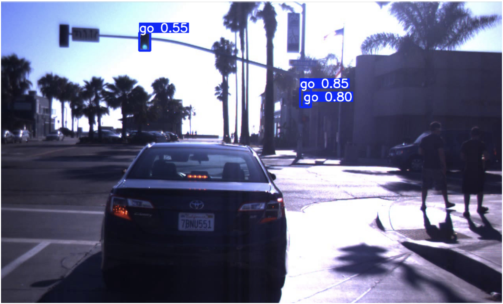
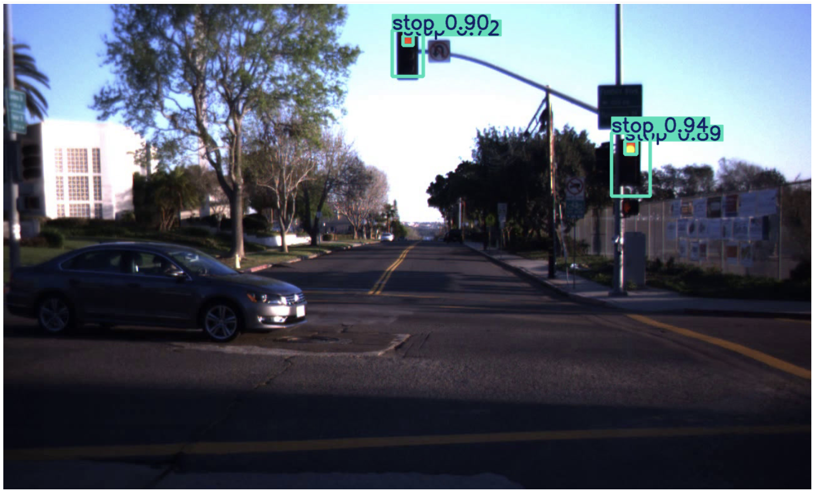
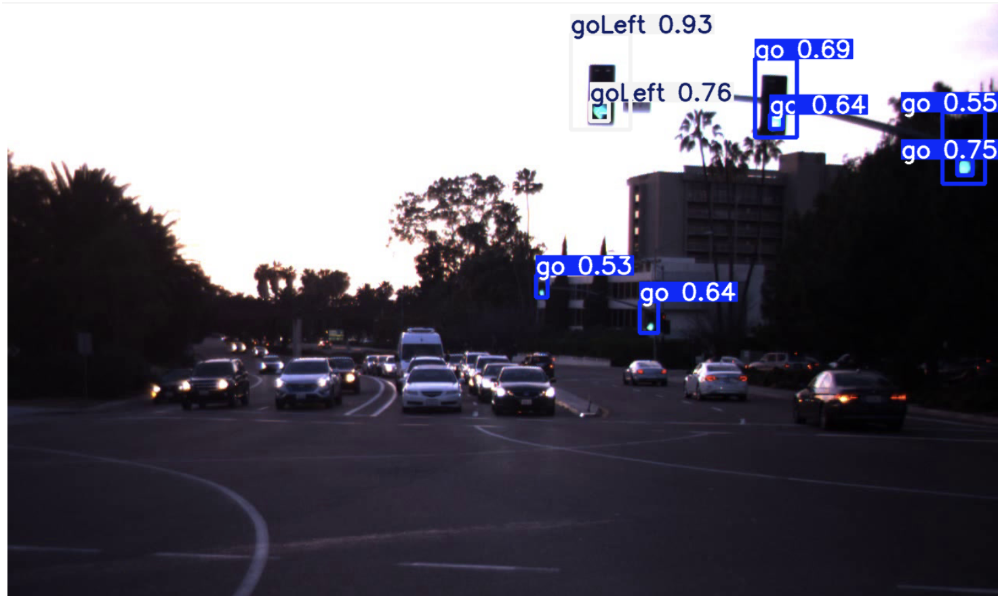

# Traffic Sign Detection using YOLOv8 and LISA Dataset

This project focuses on real-time traffic sign detection using the YOLOv8 object detection model trained on the LISA Traffic Sign Dataset.

---

## Project Overview

- **Model**: YOLOv8 (You Only Look Once version 8)
- **Dataset**: LISA Traffic Sign Dataset
- **Task**: Object Detection (bounding boxes around traffic signs)
- **Framework**: Ultralytics YOLOv8 + PyTorch

---

## Folder Structure

```
traffic-signal-detection/
├── data/
│   ├── images/
│   │   ├── train/
│   │   └── val/
│   └── labels/
│       ├── train/
│       └── val/
├── yolov8n.pt                # Pretrained YOLOv8 nano weights (optional)
├── runs/                     # YOLOv8 training outputs
├── detect.py                 # Detection script
├── train.py                  # Training script (optional)
├── utils/                    # Any helper scripts
├── requirements.txt
├── data.yaml
└── README.md
```

---

## Getting Started

### 1. Clone the Repository

```bash
git clone https://github.com/your-username/traffic-signal-detection.git
cd traffic-signal-detection
```

### 2. Install Dependencies

```bash
pip install -r requirements.txt
```

Or manually install YOLOv8:

```bash
pip install ultralytics
```

### 3. Dataset Setup

Make sure your dataset is structured like this:

```
data/
├── images/
│   ├── train/
│   └── val/
└── labels/
    ├── train/
    └── val/
```

Each image should have a corresponding `.txt` file in YOLO format under `labels/`.

---

## Training the Model

```bash
yolo detect train data=data.yaml model=yolov8n.pt epochs=50 imgsz=640
```

> `data.yaml` should point to your dataset and class names.

---

## Running Inference

```bash
yolo detect predict model=runs/detect/train/weights/best.pt source=data/images/val
```

---

## Results





---

## LISA Dataset

- Official site: [http://cvrr.ucsd.edu/LISA/lisa-traffic-sign-dataset.html](https://www.kaggle.com/datasets/mbornoe/lisa-traffic-light-dataset)
- You may need to convert annotations to YOLO format (done in this project).

---

## License

This project is under the MIT License. Dataset belongs to its respective owners (LISA lab, UCSD).

---

## Acknowledgements

- [Ultralytics YOLOv8](https://github.com/ultralytics/ultralytics)
- [LISA Traffic Sign Dataset](http://cvrr.ucsd.edu/LISA/lisa-traffic-sign-dataset.html)

## Author
- Ajay Tiwari
- B.Tech - Computer Science and Engineering (Artificial Intelligence) : 2022-26

## Licence
MIT Licence - Feel free to use, modify and share with attribution.


